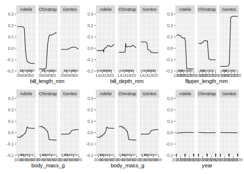

# Model Interpretation {#interpretation}


## IML {#iml}

*Author: [Shawn Storm]*

### Introduction{#iml-intro}

`iml` is an R package that interprets the behavior and explains predictions of machine learning models. The functions provided in the `iml` package are model-agnostic which gives the flexibility to use any machine learning model.

This chapter provides examples of how to use `iml` with `mlr3`. For more information refer to the  [IML github](https://github.com/christophM/iml) and the [IML book](https://christophm.github.io/interpretable-ml-book/)

### Example{#setup}

To understand what `iml` can offer, we start off with a thorough example. The goal of this example is to figure out the species of penguins given a set of features. The `palmerpenguins` data set will be used which is an alternative to the `iris` data set. `palmerpenguins` contains two data sets: 
  
* [palmerpenguins::penguins](https://allisonhorst.github.io/palmerpenguins/reference/penguins.html) 
* [palmerpenguins::penguins_raw](https://allisonhorst.github.io/palmerpenguins/reference/penguins_raw.html)

The `palmerpenguins::penguins` data set contains 8 variables (n = 344 penguins) and contains 333 complete cases with 19 missing values:
  

```r
library("palmerpenguins")
head(penguins)
```

```
## # A tibble: 6 x 8
##   species island bill_length_mm bill_depth_mm flipper_length_… body_mass_g sex  
##   <fct>   <fct>           <dbl>         <dbl>            <int>       <int> <fct>
## 1 Adelie  Torge…           39.1          18.7              181        3750 male 
## 2 Adelie  Torge…           39.5          17.4              186        3800 fema…
## 3 Adelie  Torge…           40.3          18                195        3250 fema…
## 4 Adelie  Torge…           NA            NA                 NA          NA NA   
## 5 Adelie  Torge…           36.7          19.3              193        3450 fema…
## 6 Adelie  Torge…           39.3          20.6              190        3650 male 
## # … with 1 more variable: year <int>
```


To get started run:
  

```r
library("iml")
library("mlr3")
library(mlr3learners)
library("palmerpenguins")
set.seed(1)
```
        
        

```r
penguins = na.omit(penguins)
data = penguins
task_peng = TaskClassif$new(id = "Species", backend = data, target = "species")
```


`penguins = na.omit(penguins)` is to omit the 19 cases with missing values. If not omitted, there will be an error when running the learner from the data points that have N/A for some features. . 


```r
learner = mlr_learners$get("classif.ranger")
learner$predict_type = "prob"
learner$train(task_peng)
learner$model
```

```
## Ranger result
## 
## Call:
##  ranger::ranger(dependent.variable.name = task$target_names, data = task$data(),      probability = self$predict_type == "prob", case.weights = task$weights$weight) 
## 
## Type:                             Probability estimation 
## Number of trees:                  500 
## Sample size:                      333 
## Number of independent variables:  7 
## Mtry:                             2 
## Target node size:                 10 
## Variable importance mode:         none 
## Splitrule:                        gini 
## OOB prediction error (Brier s.):  0.0179
```

```r
x = penguins[which(names(penguins) != "species")]
model = Predictor$new(learner, data = x, y = penguins$species)
```

As explained in Section [2.3](https://mlr3book.mlr-org.com/learners.html), specific learners can be queried with `mlr_learners`. In Section [2.5](https://mlr3book.mlr-org.com/train-predict.html) it is recommended for some classifiers to use the `predict_type` as `prob` instead of directly predicting a label. This is what is done in this example. `penguins[which(names(penguins) != "species")]` is the data of all the features and `y` will be the penguins`species`. `learner$train(task_peng)` trains the model and `learner$model` stores the model from the training command. `Predictor` holds the the machine learning model and the data. All interpretation methods in `iml` need the the machine learning model and the data to be wrapped in the `Predictor` object. 

Next is the core functionality of `iml`. In this example three separate interpretation methods will be used: [FeatureEffects](https://github.com/christophM/iml/blob/master/R/FeatureEffects.R), [FeatureImp](https://github.com/christophM/iml/blob/master/R/FeatureImp.R) and [Shapley](https://github.com/christophM/iml/blob/master/R/Shapley.R)


* `FeatureEffects` computes the effects for all given features on the model prediction. Different methods are implemented: [Accumulated Local Effect (ALE) plots](https://christophm.github.io/interpretable-ml-book/ale.html), [Partial Dependence Plots (PDPs)](https://christophm.github.io/interpretable-ml-book/pdp.html) and [Individual Conditional Expectation (ICE) curves](https://christophm.github.io/interpretable-ml-book/ice.html).

* `FeatureImp` computes the importance of features by calculating the increase in the model's prediction error after permuting the feature (more [here](https://christophm.github.io/interpretable-ml-book/feature-importance.html#feature-importance)).

* `Shapley` computes feature contributions for single predictions with the Shapley value -- an approach from cooperative game theory ([Shapley Value](https://christophm.github.io/interpretable-ml-book/shapley.html)).


**FeatureEffects**

In addition to the commands above the following two need to be ran:


```r
effect = FeatureEffects$new(model)
effect$plot(features = c("bill_length_mm","bill_depth_mm", "flipper_length_mm", "body_mass_g", "body_mass_g","year"))
```

<div class="figure" style="text-align: center">

<p class="caption">(\#fig:eff)Plot of the results from FeatureEffects. FeatureEffects computes and plots feature effects of prediction models</p>
</div>

`effect` stores the object from the `FeatureEffect` computation and the results can then be plotted. In this example, all of the features provided by the `palmerpenguins` data set were used. 


All features except for `year` provide meaningful interpretable information. It should be clear why `year` doesn't provide anything of significance. `bill_length_mm` shows for example that when the bill length is smaller than roughly 40mm, there is a high chance that the penguin is an Adelie. 

**Shapley**
  

```r
x = penguins[which(names(penguins) != "species")]
model = Predictor$new(learner, data = penguins, y = "species")
x.interest <-data.frame(penguins[1,])
shapley <- Shapley$new(model, x.interest = x.interest)
plot(shapley)
```

<div class="figure" style="text-align: center">

<p class="caption">(\#fig:mod)Plot of the results from Shapley. $\phi$ gives the increase or decrease in probabilty given the values on the vertical axis</p>
</div>

The $\phi$ provides insight into the probability given the values on the vertical axis. For example, a penguin is less likely to be Gentoo if the bill_depth_=18.7 is and much more likely to be Adelie than Chinstrap.


**FeatureImp**


```r
effect = FeatureImp$new(model, loss = "ce")
effect$plot(features = c("bill_length_mm","bill_depth_mm", "flipper_length_mm", "body_mass_g", "body_mass_g","year"))
```

<div class="figure" style="text-align: center">

<p class="caption">(\#fig:imp)Plot of the results from FeatureImp. FeatureImp visualizes the importance of features given the prediction model</p>
</div>


`FeatureImp` shows the level of importance of the features when classifying the penguins. It is clear to see that the `bill_length_mm` is of high importance and one should concentrate on different boundaries of this feature when attempting to classify the three species. 


**Predicting**
  
It is also interesting to see how well the model performs on a data set. For this section, exactly as was recommended in Section [2.4](https://mlr3book.mlr-org.com/train-predict.html) of the mlr3book, 80% of the penguin data set will be used for the training set and 20% for the test set:
  

```r
train_set = sample(task_peng$nrow, 0.8 * task_peng$nrow)
test_set = setdiff(seq_len(task_peng$nrow), train_set)
learner$train(task_peng, row_ids = train_set)
prediction = learner$predict(task_peng, row_ids = test_set)
```

And the plots below show the results for `FeatureImp` and `FeatureEffect`.

`FeatureImp`:

```r
model = Predictor$new(learner, data = penguins[train_set,], y = "species")
effect = FeatureImp$new(model, loss ="ce" )
effect$plot(features = c("bill_length_mm","bill_depth_mm", "flipper_length_mm", "body_mass_g", "body_mass_g","year"))
```

<div class="figure" style="text-align: center">

<p class="caption">(\#fig:featimppred)FeatImp train data set</p>
</div>

The results of the train set for `FeatureImp` (and `FeatureEffect`) are similar to the results above, which is expected. 


```r
model = Predictor$new(learner, data = penguins[test_set,], y = "species")
effect = FeatureImp$new(model, loss ="ce" )
effect$plot(features = c("bill_length_mm","bill_depth_mm", "flipper_length_mm", "body_mass_g", "body_mass_g","year"))
```

<div class="figure" style="text-align: center">

<p class="caption">(\#fig:featimptest)FeatImp test data set</p>
</div>


Both the train and test data set can be used to analyze the feature effects. 

`FeatureEffects`:

```r
model = Predictor$new(learner, data = penguins[train_set,], y = "species")
effect = FeatureEffects$new(model)
effect$plot(features = c("bill_length_mm","bill_depth_mm", "flipper_length_mm", "body_mass_g", "body_mass_g","year"))
```

<div class="figure" style="text-align: center">

<p class="caption">(\#fig:feateffreal)FeatEffect train data set</p>
</div>


```r
model = Predictor$new(learner, data = penguins[test_set,], y = "species")
effect = FeatureEffects$new(model)
effect$plot(features = c("bill_length_mm","bill_depth_mm", "flipper_length_mm", "body_mass_g", "body_mass_g","year"))
```

<div class="figure" style="text-align: center">

<p class="caption">(\#fig:featefftest)FeatEffect test data set</p>
</div>


As is the case with `FeatureImp`, the test data results show either an over- or underestimate of feature importance / feature effects compared to the results where the entire penguin data set was used. This would be a good opportunity for the reader to attempt to resolve the estimation by playing with the amount of features and the amount of data used for both the test and train data sets of `FeatureImp` and `FeatureEffects`. Be sure to not change the line `train_set = sample(task_peng$nrow, 0.8 * task_peng$nrow)` as it will randomly sample the data again.


## DALEX {#interpretability-dalex}

*Authors: [Przemysław Biecek](https://github.com/pbiecek), [Szymon Maksymiuk](https://github.com/maksymiuks)*

### Introduction {#interpretability-dalex-introduction}

The [DALEX](https://cran.r-project.org/package=DALEX) package X-rays any predictive model and helps to explore, explain and visualize its behaviour. The package implements a collection of methods for [Explanatory Model Analysis](https://pbiecek.github.io/ema/). It is based on a unified grammar summarised in Figure \@ref(08-interpretation-001).

In the following sections, we will present subsequent methods available in the DALEX package based on a random forest model trained for football players worth prediction on the FIFA 20 data. We will show both methods analyzing the model at the level of a single prediction and the global level - for the whole data set.

The structure of this chapter is the following:

* In Section \@ref(interpretability-data-fifa) we introduce the FIFA 20 dataset and then in section \@ref(interpretability-train-ranger) we train a random regression forest using the [ranger](https://cran.r-project.org/package=ranger) package.
* Section \@ref(interpretability-architecture) introduces general logic beyond DALEX explainers.
* Section \@ref(interpretability-dataset-level) introduces methods for dataset level model exploration.
* Section \@ref(interpretability-instance-level) introduces methods for instance-level model exploration.


<div class="figure" style="text-align: center">

<p class="caption">(\#fig:08-interpretation-001)Taxonomy of methods for model exploration presented in this chapter. Left part overview methods for instance level exploration while right part is related to dataset level model exploration.</p>
</div>


### Read data: FIFA {#interpretability-data-fifa}

Examples presented in this chapter are based on data retrieved from the FIFA video game. We will use the data scrapped from the [sofifa](https://sofifa.com/) website. The raw data is available at  [kaggle](https://www.kaggle.com/stefanoleone992/fifa-20-complete-player-dataset). After some basic data cleaning, the processed data for the top 5000 football players is available in the DALEX package under the name `fifa`.


```r
library("DALEX")
fifa[1:2,c("value_eur", "age", "height_cm", "nationality", "attacking_crossing")]
```

```
##                   value_eur age height_cm nationality attacking_crossing
## L. Messi           95500000  32       170   Argentina                 88
## Cristiano Ronaldo  58500000  34       187    Portugal                 84
```

For every player, we have 42 features available.


```r
dim(fifa)
```

```
## [1] 5000   42
```

In the table below we overview these 42 features for three selected players.
One of the features, called `value_eur`, is the worth of the footballer in euros. In the next section, we will build a prediction model, which will estimate the worth of the player based on other player characteristics.


|     |Lionel Messi |Cristiano Ronaldo |Neymar Junior |
|:--------------------------|:------------|:-----------------|:-------------|
|wage_eur                   |565000       |405000            |290000      |
|age  |32       |34            |27      |
|height_cm                  |170      |187           |175     |
|weight_kg                  |72       |83            |68      |
|nationality                |Argentina |Portugal     |Brazil  |
|overall                    |94       |93            |92      |
|potential                  |94       |93            |92      |
|value_eur                  |95 500 000 |58 500 000      |105 500 000                     |
|attacking_crossing         |88       |84            |87      |
|attacking_finishing        |95       |94            |87      |
|attacking_heading_accuracy |70       |89            |62      |
|attacking_short_passing    |92       |83            |87      |
|attacking_volleys          |88       |87            |87      |
|skill_dribbling            |97       |89            |96      |
|skill_curve                |93       |81            |88      |
|skill_fk_accuracy          |94       |76            |87      |
|skill_long_passing         |92       |77            |81      |
|skill_ball_control         |96       |92            |95      |
|movement_acceleration      |91       |89            |94      |
|movement_sprint_speed      |84       |91            |89      |
|movement_agility           |93       |87            |96      |
|movement_reactions         |95       |96            |92      |
|movement_balance           |95       |71            |84      |
|power_shot_power           |86       |95            |80      |
|power_jumping              |68       |95            |61      |
|power_stamina              |75       |85            |81      |
|power_strength             |68       |78            |49      |
|power_long_shots           |94       |93            |84      |
|mentality_aggression       |48       |63            |51      |
|mentality_interceptions    |40       |29            |36      |
|mentality_positioning      |94       |95            |87      |
|mentality_vision           |94       |82            |90      |
|mentality_penalties        |75       |85            |90      |
|mentality_composure        |96       |95            |94      |
|defending_marking          |33       |28            |27      |
|defending_standing_tackle  |37       |32            |26      |
|defending_sliding_tackle   |26       |24            |29      |
|goalkeeping_diving         |6        |7             |9       |
|goalkeeping_handling       |11       |11            |9       |
|goalkeeping_kicking        |15       |15            |15      |
|goalkeeping_positioning    |14       |14            |15      |
|goalkeeping_reflexes       |8        |11            |11      |


In order to get a more stable model we remove four variables i.e. `nationality`, `overall`, `potential`, `wage_eur`.


```r
fifa[,c('nationality', 'overall', 'potential', 'wage_eur')] <- NULL
for (i in 1:ncol(fifa))           fifa[,i] <- as.numeric(fifa[,i])
```


### Train a model: Ranger {#interpretability-train-ranger}

The `DALEX` package works for any model regardless of its internal structure. Examples of how this package works are shown on a random forest model implemented in the [ranger](https://cran.r-project.org/package=ranger) package.


We use the `mlr3` package to build a predictive model.
First, let's load the required packages.


```r
library("mlr3")
library("mlr3learners")
```

Then we can define the regression task - prediction of the `value_eur` variable:


```r
fifa_task <- TaskRegr$new(id = "fifa", backend = fifa, target = "value_eur")
```

Finally, we train mlr3's [`ranger learner`](https://mlr3learners.mlr-org.com/reference/mlr_learners_regr.ranger.html) with 250 trees. Note that in this example for brevity we do not split the data into a train/test data. The model is built on the whole data.


```r
fifa_ranger <- lrn("regr.ranger")
fifa_ranger$param_set$values <- list(num.trees = 250)
fifa_ranger$train(fifa_task)
fifa_ranger
```

```
## <LearnerRegrRanger:regr.ranger>
## * Model: ranger
## * Parameters: num.trees=250
## * Packages: ranger
## * Predict Type: response
## * Feature types: logical, integer, numeric, character, factor, ordered
## * Properties: importance, oob_error, weights
```

### The general workflow {#interpretability-architecture}

Working with explanations in the DALEX package always consists of three steps schematically shown in the pipe below.

```
model %>%
  explain_mlr3(data = ..., y = ..., label = ...) %>%
  model_parts() %>%
  plot()
```

1. All functions in the DALEX package can work for models with any structure. It is possible because in the first step we create an adapter that allows the downstream functions to access the model in a consistent fashion. In general, such an adapter is created with [`DALEX::explain()`](https://www.rdocumentation.org/packages/DALEX/topics/explain) function, but for models created in the `mlr3` package it is more convenient to use the [`DALEXtra::explain_mlr3()`](https://www.rdocumentation.org/packages/DALEXtra/topics/explain_mlr3).

2. Explanations are determined by the functions [`DALEX::model_parts()`](https://www.rdocumentation.org/packages/DALEX/topics/model_parts), [`DALEX::model_profile()`](https://www.rdocumentation.org/packages/DALEX/topics/model_profile), [`DALEX::predict_parts()`](https://www.rdocumentation.org/packages/DALEX/topics/predict_parts) and [`DALEX::predict_profile()`](https://www.rdocumentation.org/packages/DALEX/topics/predict_profile). Each of these functions takes the model adapter as its first argument. The other arguments describe how the function works. We will present them in the following section.

3. Explanations can be visualized with the generic function `plot` or summarised with the generic function [`print()`](https://www.rdocumentation.org/packages/base/topics/print). Each explanation is a data frame with an additional class attribute. The `plot` function creates graphs using the [ggplot2](https://cran.r-project.org/package=ggplot2) package, so they can be easily modified with usual `ggplot2` decorators.

We show this cascade of functions based on the FIFA example.

To get started with the exploration of the model behaviour we need to create an explainer. [`DALEX::explain`](https://www.rdocumentation.org/packages/DALEX/topics/explain) function handles is for all types of predictive models. In the [DALEXtra](https://cran.r-project.org/package=DALEXtra) package there generic versions for the most common ML frameworks. Among them the [`DALEXtra::explain_mlr3()`](https://www.rdocumentation.org/packages/DALEXtra/topics/explain_mlr3) function works for `mlr3` models.

This function performs a series of internal checks so the output is a bit verbose. Turn the `verbose = FALSE` argument to make it less wordy.


```r
library("DALEX")
library("DALEXtra")

ranger_exp <- explain_mlr3(fifa_ranger,
        data     = fifa,
        y        = fifa$value_eur,
        label    = "Ranger RF",
        colorize = FALSE)
```

```
## Preparation of a new explainer is initiated
##   -> model label       :  Ranger RF 
##   -> data              :  5000  rows  38  cols 
##   -> target variable   :  5000  values 
##   -> predict function  :  yhat.LearnerRegr  will be used (  default  )
##   -> predicted values  :  numerical, min =  508824 , mean =  7474466 , max =  91255800  
##   -> model_info        :  package mlr3 , ver. 0.8.0 , task regression (  default  ) 
##   -> residual function :  difference between y and yhat (  default  )
##   -> residuals         :  numerical, min =  -11282333 , mean =  -1179 , max =  19042967  
##   A new explainer has been created!
```

### Dataset level exploration {#interpretability-dataset-level}

The [`DALEX::model_parts()`](https://www.rdocumentation.org/packages/DALEX/topics/model_parts) function calculates the importance of variables using the [permutations based importance](https://pbiecek.github.io/ema/featureImportance.html).


```r
fifa_vi <- model_parts(ranger_exp)
head(fifa_vi)
```

```
##              variable mean_dropout_loss     label
## 1        _full_model_           1300360 Ranger RF
## 2           value_eur           1300360 Ranger RF
## 3           weight_kg           1361645 Ranger RF
## 4    movement_balance           1363426 Ranger RF
## 5 goalkeeping_kicking           1369167 Ranger RF
## 6           height_cm           1373286 Ranger RF
```

Results can be visualized with generic `plot()`. The chart for all 38 variables would be unreadable, so with the `max_vars` argument, we limit the number of variables on the plot.


```r
plot(fifa_vi, max_vars = 12, show_boxplots = FALSE)
```


Once we know which variables are most important, we can use [Partial Dependence Plots](https://pbiecek.github.io/ema/partialDependenceProfiles.html) to show how the model, on average, changes with changes in selected variables. In this example, they show the average relation between the particular variables and players' value.


```r
selected_variables <- c("age", "movement_reactions",
                "skill_ball_control", "skill_dribbling")

fifa_pd <- model_profile(ranger_exp,
                variables = selected_variables)$agr_profiles
fifa_pd
```

```
## Top profiles    : 
##              _vname_   _label_ _x_  _yhat_ _ids_
## 1 skill_ball_control Ranger RF   5 7411047     0
## 2    skill_dribbling Ranger RF   7 7802690     0
## 3    skill_dribbling Ranger RF  11 7797969     0
## 4    skill_dribbling Ranger RF  12 7797996     0
## 5    skill_dribbling Ranger RF  13 7798892     0
## 6    skill_dribbling Ranger RF  14 7798466     0
```

Again, the result of the explanation can be presented with the generic function `plot()`.


```r
library("ggplot2")
plot(fifa_pd) +
  scale_y_continuous("Estimated value in Euro", labels = scales::dollar_format(suffix = "€", prefix = "")) +
  ggtitle("Partial Dependence profiles for selected variables")
```


The general trend for most player characteristics is the same. The higher are the skills the higher is the player's worth. With a single exception – variable Age.


### Instance level explanation {#interpretability-instance-level}

Time to see how the model behaves for a single observation/player
This can be done for any player, but this example we will use the Cristiano Ronaldo.

The function `predict_parts` is an instance-level version of the `model_parts` function introduced in the previous section. For the background behind that method see the [Introduction to Break Down](https://pbiecek.github.io/ema/breakDown.html).


```r
ronaldo <- fifa["Cristiano Ronaldo",]
ronaldo_bd_ranger <- predict_parts(ranger_exp,
                        new_observation = ronaldo)
head(ronaldo_bd_ranger)
```

```
##                                       contribution
## Ranger RF: intercept                       7474466
## Ranger RF: movement_reactions = 96        11228394
## Ranger RF: skill_ball_control = 92         6489446
## Ranger RF: attacking_finishing = 94        4463150
## Ranger RF: mentality_positioning = 95      4931204
## Ranger RF: skill_dribbling = 89            4274708
```

The generic `plot()` function shows the estimated contribution of variables to the final prediction.

Cristiano is a striker, therefore characteristics that influence his worth are those related to attack, like `attacking_volleys` or `skill_dribbling`. The only variable with negative attribution is `age`.


```r
plot(ronaldo_bd_ranger)
```


Another way to inspect the local behaviour of the model is to use [SHapley Additive exPlanations (SHAP)](https://pbiecek.github.io/ema/shapley.html). It locally shows the contribution of variables to a single observation, just like Break Down.


```r
ronaldo_shap_ranger <- predict_parts(ranger_exp,
                        new_observation = ronaldo,
                        type = "shap")

plot(ronaldo_shap_ranger) +
  scale_y_continuous("Estimated value in Euro", labels = scales::dollar_format(suffix = "€", prefix = ""))
```


In the previous section, we've introduced a global explanation - Partial Dependence Plots. [Ceteris Paribus](https://pbiecek.github.io/ema/ceterisParibus.html) is the instance level version of that plot. It shows the response of the model for observation when we change only one variable while others stay unchanged. Blue dot stands for the original value.


```r
selected_variables <- c("age", "movement_reactions",
                "skill_ball_control", "skill_dribbling")

ronaldo_cp_ranger <- predict_profile(ranger_exp, ronaldo, variables = selected_variables)

plot(ronaldo_cp_ranger, variables = selected_variables) +
  scale_y_continuous("Estimated value of Christiano Ronaldo", labels = scales::dollar_format(suffix = "€", prefix = ""))
```


